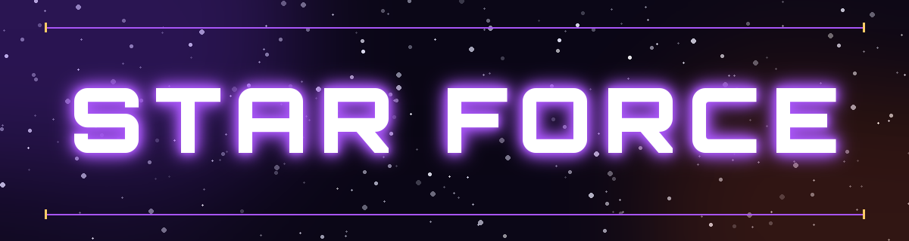
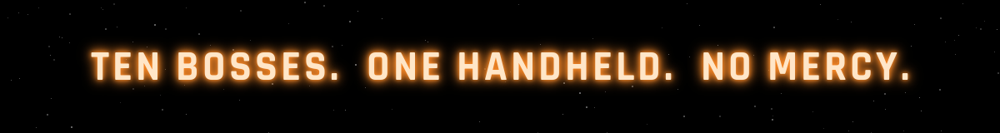

 

**Created for the TrimUI Brick**

Arcade-style boss rush game pak with upgradable weapons, shields, and a synth soundtrack.
Built by SkyWalker541 for the TrimUI Brick.

 

---

## ▸ THE GAUNTLET

| № | BOSS | DESIGNATION |
|:---:|:---|:---|
| 01 | **THE WALL** | An armored carapace that doesn't move — it doesn't have to |
| 02 | **NEEDLER** | Bioluminescent and bristling with crystalline spikes |
| 03 | **SPINNER** | Never stops turning, never stops firing |
| 04 | **THE EYE** | It sees you. It always sees you |
| 05 | **FORTRESS** | A battlement with a grudge |
| 06 | **PHANTOM** | Blinks in. Blinks out. Leaves wreckage behind |
| 07 | **HORDE** | Why send one enemy when you can send a swarm |
| 08 | **SPLITTER** | Destroy it and you'll wish you hadn't |
| 09 | **SHIELDER** | Patient, regenerating, nearly untouchable |
| 10 | **OVERSEER** | Everything that came before — answering to this |

---

## ▸ SHIP SYSTEMS

| WEAPONS | DEFENSE | AUDIO |
|:---:|:---:|:---:|
| Upgradable spread shot &amp; rapid fire | Stacking shields | Original synth score |
| Forward-arc heavy fire | Overshield invulnerability | Dynamic menu / combat / boss themes |

